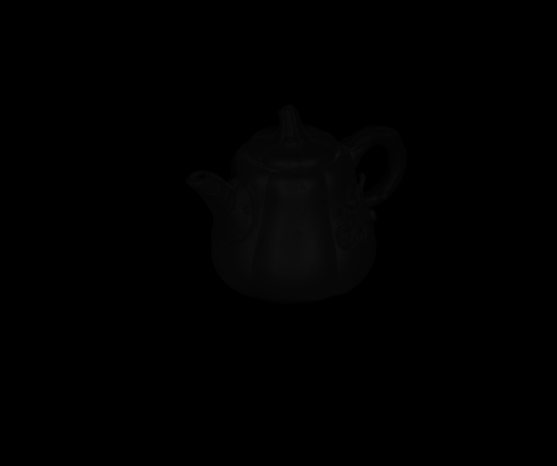
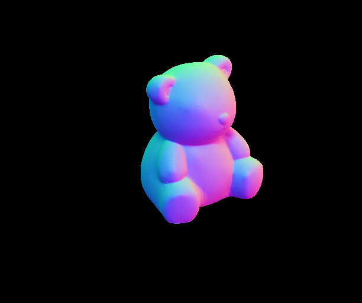
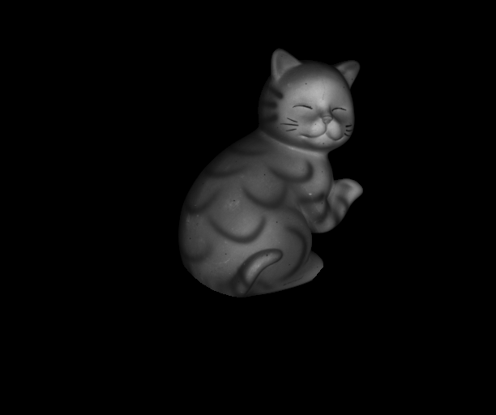
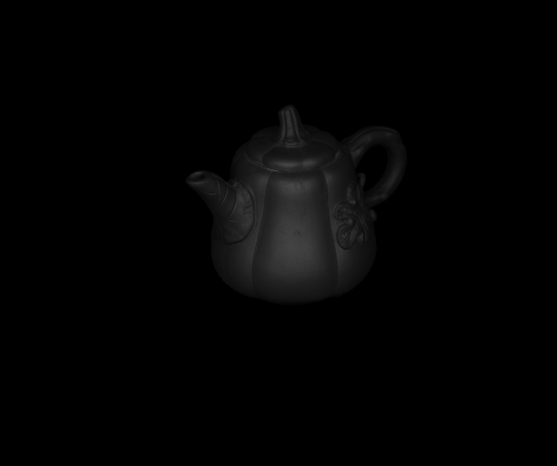

# Photometric Stereo

## Environment

* MATLAB 2022b

## Analysis and Conclusion

### Results

|        | Bear                                 | Buddha                                 | Cat                                 | Pot                                 |
| ------ | ------------------------------------ | -------------------------------------- | ----------------------------------- | ----------------------------------- |
| Albedo |  |  |  |  |
| Normal |  |  |  |  |
| Render |  |  |  |  |

### Comparison with non-highlight & shadow handling

|                                           | Bear                                 | Buddha                                 | Cat                                 | Pot                                 |
| ----------------------------------------- | ------------------------------------ | -------------------------------------- | ----------------------------------- | ----------------------------------- |
| **Albedo w/ highlight & shadow handling** |  |  |  |  |
| Albedo w/o highlight & shadow handling    |    |    |    |    |
| **Render w/ highlight & shadow handling** |  |  |  |  |
| Render w/o highlight & shadow handling    |    |    |    |    |

Obviously, after processing, the highlight area becomes less shiny and more consistent with Lambert's model.

