# Photometric Stereo

22221290 Jiarun Liu

## Environment

* MATLAB 2022b

## Implementation Details

### Principle

The whole process is simple and direct. The rendering illumination and light ray is given in the data file, and the pixel intensity of the observation is also known. According to linear function:
$$
\bold I_{n\times1}=L_{n\times m}\bold b_{m\times 1}
$$
in which $n$ is the number of pixels and $m$ is number of rays, we can get:
$$
\bold b=L^{-1}\bold I=\rho\bold n
$$
A simple method here is to use the least squares method to compute $\bold b$. In practice, we use the pseudo inverse function `pinv()` in MATLAB to simplify the calculation. Since it's obvious that $n \gg m$，$L$ is full rank in column and has left inverse matrix, which is much faster than the actual inverse matrix calculation:
$$
L^L=(L^TL)^{-1}L^T
$$
Thus, we can use the approximate solution to get $\bold b$:
$$
\bold b=L^L\bold I
$$
The following steps are simple:
$$
\begin{aligned}\rho &=\|\mathbf{b}\| \\n &=\frac{1}{\rho}\|\mathbf{b}\|\end{aligned}
$$

In the rendering phase, we set the direction and intensity of the incident light. According to the calculated normal and albedo, and the rendering equation is as follows:
$$
I_i = \rho\boldsymbol n\cdot \boldsymbol l_i
$$

### Coding Details

* When calculating $\bold b$, we first set a proportion of noise to be removed. 

* Least square 

  ```matlab
  %% Calculate b using least square
  b = zeros(pixel_num, 3); 
  for i = 1: pixel_num
     L = l(:,idx(i,:)); 
     % I = L * b
     b(i,:) = I(i,:) * pinv(L); % least square
  end
  ```

* The albedo and normal maps are first flattened and later reshaped to the correct size.

## Analysis and Conclusion

The light direction for rendering is set to $[0,0,1]$ and the light intensity is set to $[5,5,5]$ for better visualizing results.

### Results

|        | Bear                                 | Buddha                                 | Cat                                 | Pot                                 |
| ------ | ------------------------------------ | -------------------------------------- | ----------------------------------- | ----------------------------------- |
| Albedo |  |  | 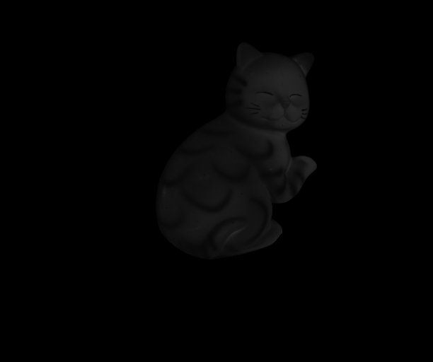 |  |
| Normal | 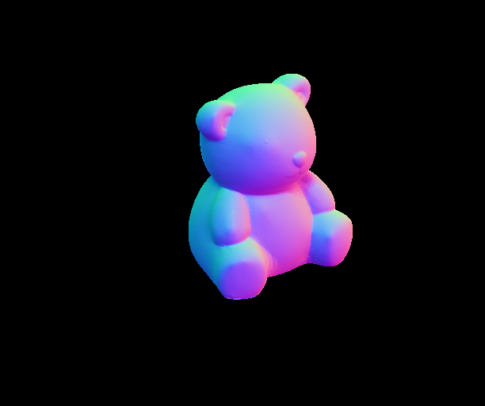 | 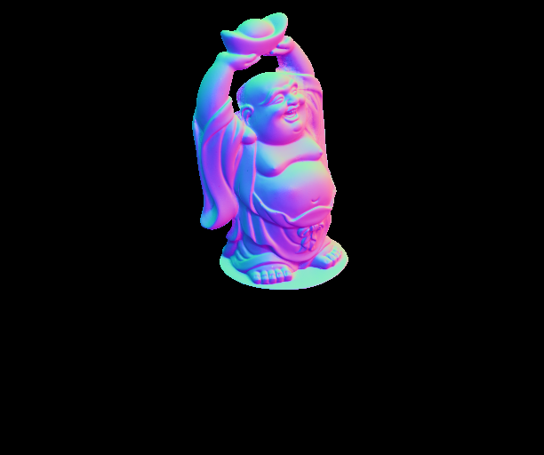 | 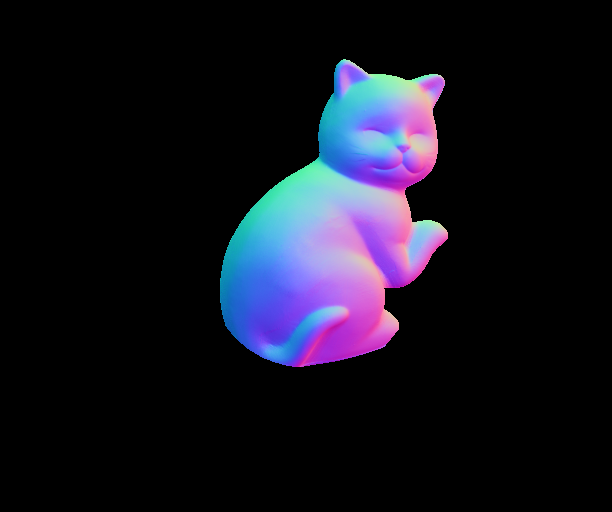 | 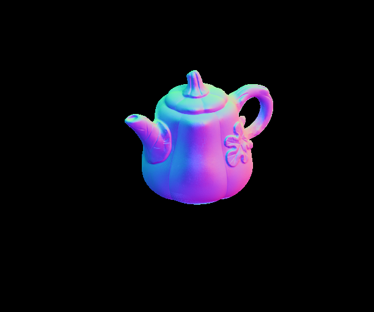 |
| Render |  | 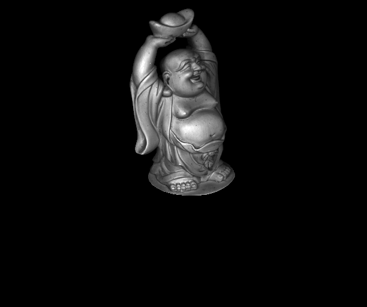 | 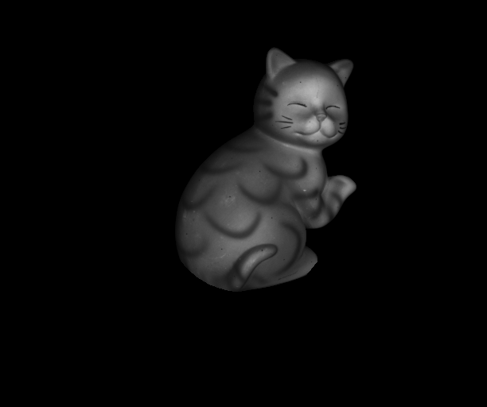 | 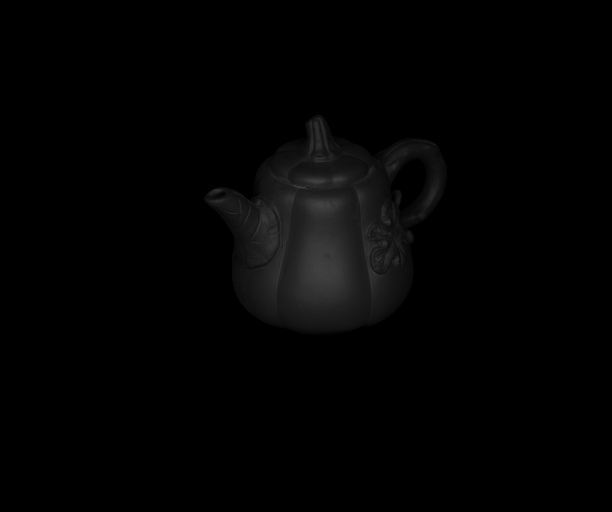 |

### Comparison with non-highlight & shadow handling

|                                           | Bear                                 | Buddha                                 | Cat                                 | Pot                                 |
| ----------------------------------------- | ------------------------------------ | -------------------------------------- | ----------------------------------- | ----------------------------------- |
| **Albedo w/ highlight & shadow handling** |  |  |  |  |
| Albedo w/o highlight & shadow handling    | 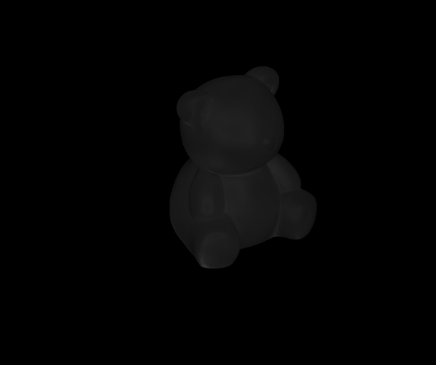   |    |    | 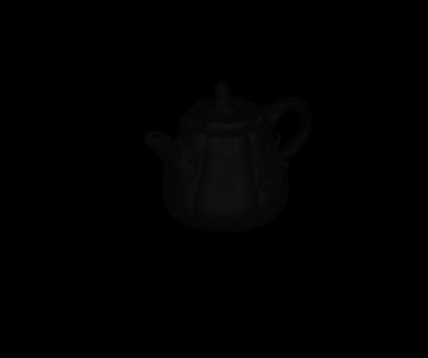   |
| **Render w/ highlight & shadow handling** |  |  |  |  |
| Render w/o highlight & shadow handling    |    | 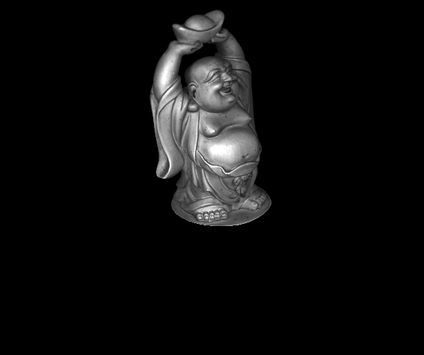   |    |    |

Obviously, after processing, the highlight area becomes less shiny and more consistent with Lambert's model.

More results and larger images please refer to `results` folder.

## Discussion

During the experiment, some failure cases occurred during testing:

|  |  |  |
| ------------------------------------- | ------------------------------------- | ------------------------------------- |

After debugging, it is indicated that $\bold b$ is miscalculated during solving the linear function. The pseudo inverse of light directions matrix $L$ is wrongly taken for its original form.

During visualization phase, I set a rather larger intensity of light for rendering because $[1,1,1]$ renders a very dark and unobservable result. Despite all these efforts, the rendering results for `potPNG` are still very bad for the original dataset is very dark.

What's more, this algorithm is already optimized by using least square method and pseudo inverse matrix, for using inverse matrix function `inv()` could cause the following hint by MATLAB, which inspired me :


Another question is I'm not sure what the real purpose of handling highlights and shadows is. I guess it's for a better fitting for Lambert's model.
