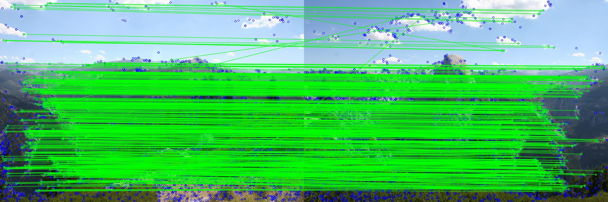
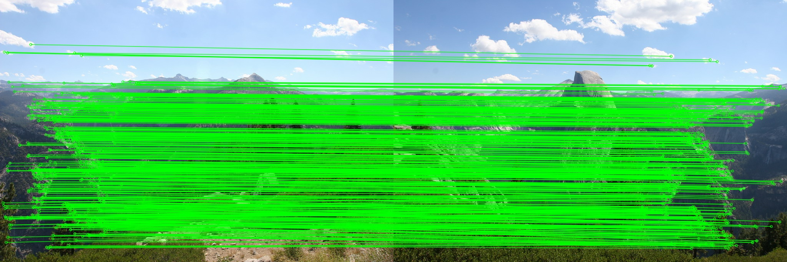
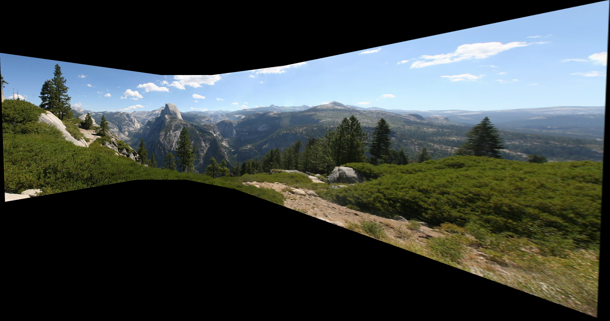

# Panorama Stitching

## Environment

* Python 3.7+ required

```bash
cd code
pip install -r requirements.txt
```

## Feature Detection, Descriptor and Matching

### Running

```bash
cd code
python feature_matching.py
```

Please check `feature_matching.py` before running. Path to the images may need to be changed. 

### Results

* SIFT detector & descriptor

  

* SIFT detector & concatenated pixel values descriptor

  

## Estimation of Homography

### Running

```bash
cd code
python homography.py
```

Please check `homography.py` before running. Path to the images may need to be changed.

### Results

* SIFT detector & descriptor + RANSAC

  

* SIFT detector & concatenated pixel values descriptor + RANSAC

  

## Image Stitching

### Running

```bash
cd code
python panorama.py
```

Please check `panorama.py` before running. Path to the images may need to be changed.

### Results

